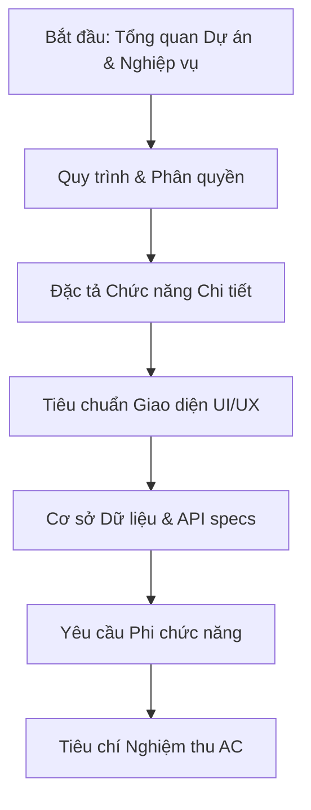

# Hệ thống Quản lý Chương trình Đào tạo (CTĐT) - TPMS (Training Program Management System)

Chào mừng bạn đến với kho lưu trữ tài liệu dự án **Hệ thống Quản lý Chương trình Đào tạo (TPMS)**. Đây là tài liệu hướng dẫn tổng quan và chi tiết giúp các bên liên quan (Stakeholders, Product Owners, Developers, QA) dễ dàng nắm bắt dự án và định vị tài liệu cần đọc theo lộ trình phù hợp.

---

## 📌 Lộ trình đọc tài liệu (Reading Roadmap)

Để tiếp cận dự án một cách hiệu quả nhất, khuyến nghị các thành viên đọc tài liệu theo thứ tự từ tổng quan đến chi tiết kỹ thuật như sau:



### 1. Tổng quan & Luồng Nghiệp vụ (Dành cho tất cả thành viên)
Giúp hiểu rõ hệ thống giải quyết bài toán gì, có những ai tham gia và quy trình phê duyệt diễn ra như thế nào.
*   **Mục tiêu chung:** Đọc [docs/temp.md](docs/temp.md) để nắm được bài toán số hóa quy trình xây dựng CTĐT và lộ trình phát triển 3 Giai đoạn (từ Nhập liệu thủ công đến Số hóa tự động và Tích hợp trợ lý AI).
*   **Tác nhân và Phân quyền:** Đọc [Định nghĩa Vai trò & Phân quyền (RBAC)](docs/ba/01_business_requirements/actors_and_permissions.md) để hiểu 6 nhóm người dùng chính (Admin, Program Manager, Lecturer, Reviewer, Approver, QA) có những quyền hạn gì trên hệ thống.
*   **Sơ đồ Quy trình:** Đọc [Sơ đồ Luồng Nghiệp vụ (BPMN/Workflows)](docs/ba/01_business_requirements/business_process_models.md) để xem cách Đề cương môn học đi qua các cấp phê duyệt, quy trình xử lý quá hạn (SLA) và cơ chế ủy quyền bằng biểu đồ Sequence trực quan.

### 2. Đặc tả Chức năng Chi tiết (Dành cho Product Owner, Dev, QA)
Mô tả chi tiết giao diện mong muốn, quy tắc xử lý nghiệp vụ (Business Rules) và các trường hợp lỗi biên (Edge Cases).
*   **Core & Quản trị:** [module_core_system.md](docs/ba/02_functional_specs/module_core_system.md) - Đăng nhập, quản lý tài khoản, hồ sơ cá nhân.
*   **Khởi tạo CTĐT:** [module_training_program.md](docs/ba/02_functional_specs/module_training_program.md) - Khởi tạo CTĐT mới, quản lý danh sách môn học.
*   **Biên soạn Đề cương:** [module_syllabus_management.md](docs/ba/02_functional_specs/module_syllabus_management.md) - Soạn thảo chuẩn đầu ra môn học (CLO), ma trận đối chiếu CLO - PLO.
*   **Quy trình Phê duyệt:** [module_approval_workflow.md](docs/ba/02_functional_specs/module_approval_workflow.md) - Nhận xét, gửi duyệt cấp bộ môn/khoa/trường, thiết lập deadline và SLA.
*   **Thông báo & Dashboard:** [module_notification_center.md](docs/ba/02_functional_specs/module_notification_center.md) & [module_dashboard.md](docs/ba/02_functional_specs/module_dashboard.md) - Theo dõi tiến độ biên soạn của giảng viên, gửi thông báo real-time/email.
*   **Báo cáo & Export:** [module_reporting.md](docs/ba/02_functional_specs/module_reporting.md) - Xuất file PDF/Excel phục vụ lưu trữ.
*   *Giai đoạn sau (Phase 2 & 3):* Đọc [module_auto_digitization.md](docs/ba/02_functional_specs/module_auto_digitization.md) (tự động bóc tách tài liệu bản cứng) và [module_ai_integration.md](docs/ba/02_functional_specs/module_ai_integration.md) (trợ lý AI đề xuất nội dung đề cương).

### 3. Tiêu chuẩn UI/UX & Giao diện (Dành cho Frontend Dev, QA)
*   **Nguyên tắc chung:** Đọc [Tiêu chuẩn thiết kế UI/UX](docs/ba/03_ui_ux_design/ui_utilities_guidelines.md) để biết cách tổ chức form nhập liệu, trạng thái Loading, và Validation lỗi.
*   **Liên kết giao diện:** Xem [Ánh xạ Wireframe](docs/ba/03_ui_ux_design/wireframe_mapping.md) và [Ma trận Thông báo Lỗi](docs/ba/03_ui_ux_design/error_message_matrix.md).

### 4. Kiến trúc Dữ liệu & API Contracts (Dành cho Backend/Frontend Dev, Architect)
*   **Sơ đồ cơ sở dữ liệu (ERD):** Đọc [data_models_erd.md](docs/ba/04_data_architecture/data_models_erd.md) để xem cấu trúc các bảng dữ liệu cốt lõi (Mermaid ERD).
*   **Từ điển dữ liệu:** Tra cứu chi tiết kiểu dữ liệu, khóa chính/ngoại tại [data_dictionary.md](docs/ba/04_data_architecture/data_dictionary.md).
*   **Đặc tả API:** Đọc [api_contracts_specs.md](docs/ba/04_data_architecture/api_contracts_specs.md) để biết các endpoint cần xây dựng (HTTP Method, Request Body, Response JSON) và [api_error_response_structure.md](docs/ba/04_data_architecture/api_error_response_structure.md) để biết cách định dạng lỗi API.

### 5. Yêu cầu Phi chức năng & Bảo mật (Dành cho Dev, DevOps)
*   Đọc [security_performance_scale.md](docs/ba/05_non_functional_reqs/security_performance_scale.md) để nắm được các yêu cầu về xử lý tranh chấp dữ liệu (Optimistic Locking), bảo vệ tính toàn vẹn (Document Freezing), giới hạn tần suất gọi API (Rate Limiting) và cơ chế mã hóa mật khẩu.

### 6. Tiêu chí Nghiệm thu - Acceptance Criteria (Dành cho QA, Tester, Dev)
Đặc tả các ca kiểm thử theo cú pháp Given-When-Then giúp QA lập Test Case và Dev viết Unit/Integration Test:
*   [Tiêu chí nghiệm thu Core System](docs/ba/06_acceptance_criteria/ac_core_system.md)
*   [Tiêu chí nghiệm thu CTĐT](docs/ba/06_acceptance_criteria/ac_training_program.md)
*   [Tiêu chí nghiệm thu Đề cương](docs/ba/06_acceptance_criteria/ac_syllabus_management.md)
*   [Tiêu chí nghiệm thu Luồng phê duyệt](docs/ba/06_acceptance_criteria/ac_approval_workflow.md)
*   [Tiêu chí nghiệm thu Báo cáo](docs/ba/06_acceptance_criteria/ac_reporting.md)

---

## 📁 Cấu trúc Thư mục Tài liệu (Folder Structure)

```text
app-quan-ly-ctdt/
│
├── docs/                               # Thư mục chứa toàn bộ tài liệu dự án
│   ├── temp.md                         # Báo cáo tóm tắt bối cảnh & quy trình nghiệp vụ tổng quát
│   │
│   └── ba/                             # Tài liệu Phân tích Nghiệp vụ chi tiết
│       ├── README.md                   # Mục lục tài liệu BA chuyên biệt
│       │
│       ├── 01_business_requirements/   # Yêu cầu cấp cao (BRD)
│       │   ├── actors_and_permissions.md
│       │   └── business_process_models.md
│       │
│       ├── 02_functional_specs/        # Đặc tả chức năng (SRS)
│       │   ├── module_core_system.md
│       │   ├── module_training_program.md
│       │   ├── module_syllabus_management.md
│       │   ├── module_approval_workflow.md
│       │   ├── module_notification_center.md
│       │   ├── module_dashboard.md
│       │   ├── module_reporting.md
│       │   ├── module_auto_digitization.md
│       │   └── module_ai_integration.md
│       │
│       ├── 03_ui_ux_design/            # Tiêu chuẩn thiết kế giao diện
│       │   ├── ui_utilities_guidelines.md
│       │   ├── error_message_matrix.md
│       │   └── wireframe_mapping.md
│       │
│       ├── 04_data_architecture/       # Kiến trúc dữ liệu & API
│       │   ├── data_models_erd.md
│       │   ├── data_dictionary.md
│       │   ├── api_contracts_specs.md
│       │   └── api_error_response_structure.md
│       │
│       ├── 05_non_functional_reqs/     # Yêu cầu phi chức năng
│       │   └── security_performance_scale.md
│       │
│       └── 06_acceptance_criteria/     # Tiêu chí nghiệm thu (Acceptance Criteria)
│           ├── ac_core_system.md
│           ├── ac_training_program.md
│           ├── ac_syllabus_management.md
│           ├── ac_approval_workflow.md
│           └── ac_reporting.md
│
└── README.md                           # File hướng dẫn hiện tại (Entry Point)
```

---

## 🚀 Trạng thái dự án hiện tại (Project Status)

*   **Tài liệu nghiệp vụ (BA):** Đã hoàn tất 100% tài liệu đặc tả chức năng, sơ đồ thực thể (ERD), thiết kế API và tiêu chí nghiệm thu cho Giai đoạn 1.
*   **Phát triển phần mềm (Dev):** Đang ở bước chuẩn bị hạ tầng phát triển. Phần code (Frontend & Backend) chưa được tạo lập.
*   **Bước tiếp theo:**
    1.  Thiết lập môi trường phát triển (Repository, Backend framework - NestJS/Express, Frontend framework - Next.js/Vite, Database - Postgres).
    2.  Tạo các model cơ sở dữ liệu dựa trên [data_models_erd.md](docs/ba/04_data_architecture/data_models_erd.md).
    3.  Lập trình Backend APIs theo [api_contracts_specs.md](docs/ba/04_data_architecture/api_contracts_specs.md).
    4.  Lập trình Frontend và kết nối API.
