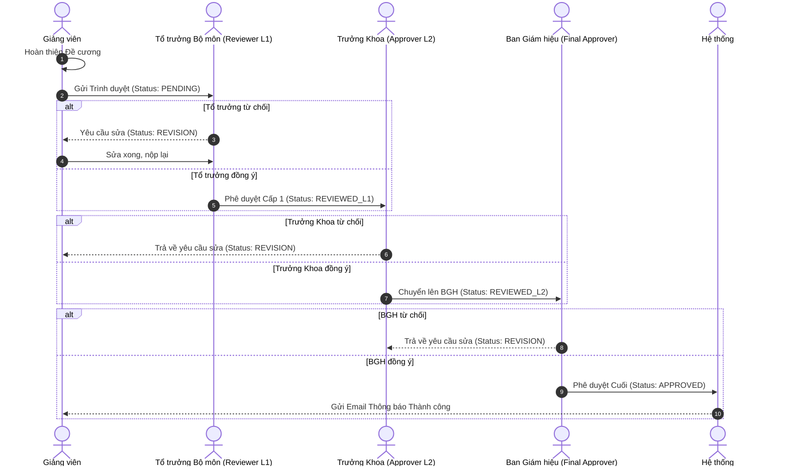
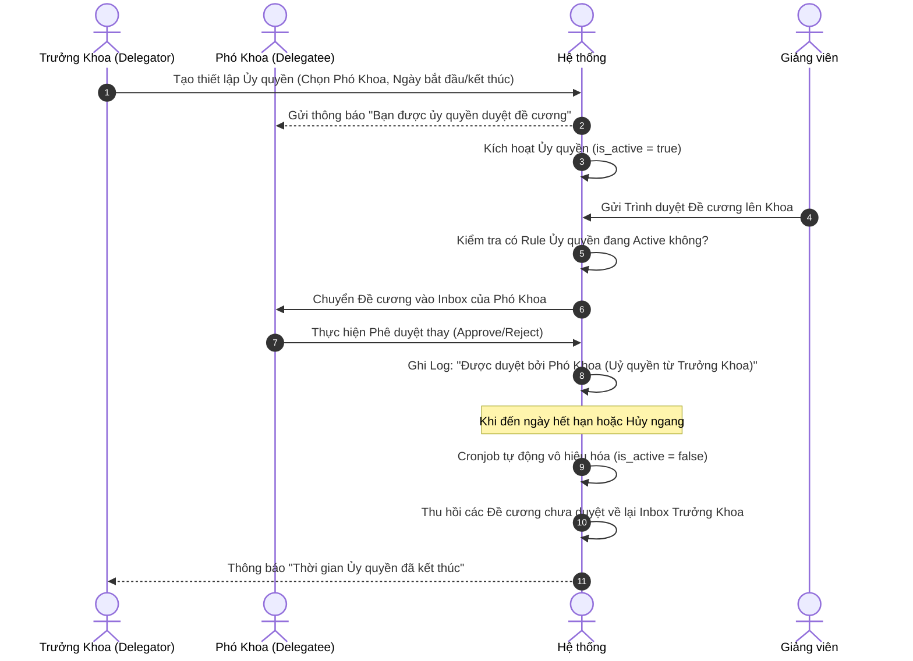
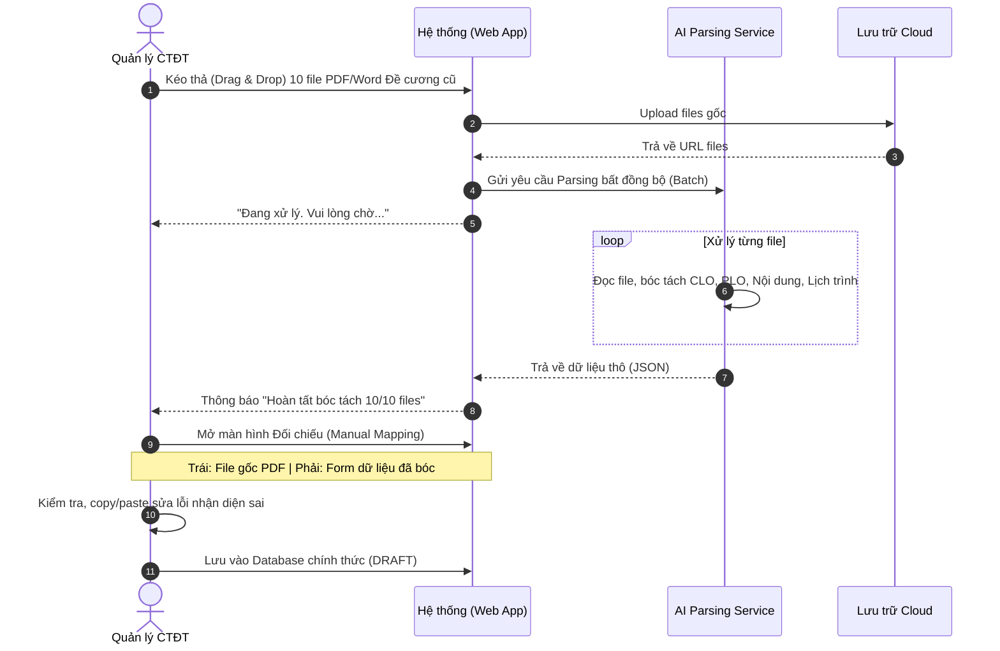
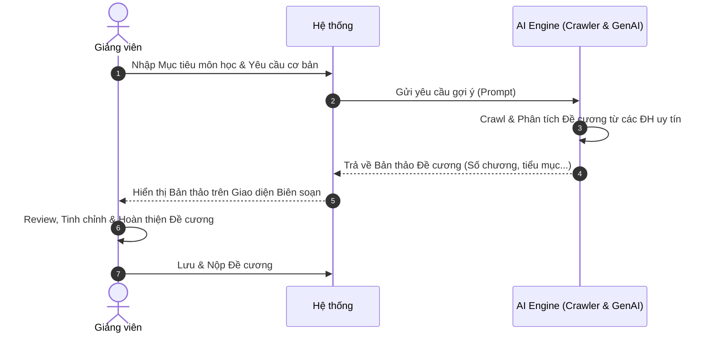

# Sơ đồ Quy trình Nghiệp vụ (Business Process Models)

Tài liệu này mô tả trực quan các luồng quy trình nghiệp vụ (Workflows) trên Hệ thống Quản lý Chương trình Đào tạo bằng biểu đồ Sequence. Các sơ đồ này là cơ sở để phát triển các chức năng và thiết kế UI/UX ở các giai đoạn sau.

---

## 1. Luồng Phê duyệt Đa cấp (Multi-level Approval Workflow)

Đây là luồng cốt lõi mô tả cách một Đề cương được duyệt qua nhiều cấp (Tổ trưởng -> Trưởng Khoa -> BGH).

*(Ghi chú: L1 và L2 đóng vai trò là Reviewer/Approver cấp trung gian tuỳ thuộc vào cấu hình của từng Khoa. BGH hoặc Hội đồng Khoa học đóng vai trò Final Approver. Quản lý CTĐT (Program Manager) chỉ theo dõi luồng này.*

**👉 Ràng buộc Chống Tự duyệt (Anti Self-Approval):** Hệ thống chặn tuyệt đối việc một User vừa đóng vai trò người soạn thảo (Lecturer) vừa đóng vai trò duyệt chính đề cương đó ở cấp L1/L2. Nếu Tổ trưởng bộ môn soạn đề cương, đề cương phải được đẩy lên cấp L2 hoặc một Reviewer khác được chỉ định duyệt, không được phép Tự duyệt ở cấp L1.)*

---

## 2. Luồng Uỷ quyền Phê duyệt (Delegation Workflow)

Mô tả cách một Trưởng Khoa (Delegator) ủy quyền cho Phó Khoa (Delegatee) duyệt thay mình trong một khoảng thời gian.

*(**👉 Ràng buộc Chống Ủy quyền Bắc cầu (Anti Chaining Delegation):** Nếu Trưởng Khoa (A) ủy quyền cho Phó Khoa (B), thì Phó Khoa (B) KHÔNG ĐƯỢC PHÉP dùng quyền Approver được thừa hưởng đó để ủy quyền tiếp cho người khác (C). Hệ thống chỉ chấp nhận tối đa 1 cấp ủy quyền.)*

---

## 3. Luồng Số hoá Tài liệu cũ (Auto Digitization Workflow)

Mô tả luồng bóc tách dữ liệu AI từ các file PDF/Word có sẵn thành dữ liệu chuẩn trong hệ thống.

---

## 4. Quy trình Trợ lý AI (Gợi ý Đề cương - Phụ lục)

Luồng nghiệp vụ minh họa việc AI hỗ trợ đề xuất Đề cương môn học.

