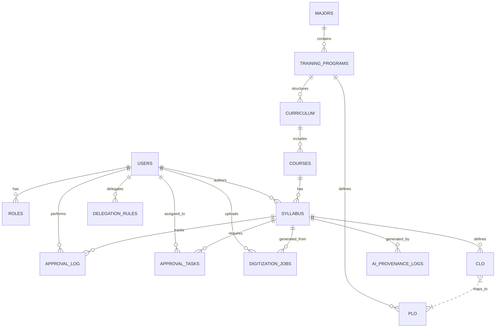

# Yêu cầu Dữ liệu sơ bộ (Data Architecture)

Dưới đây là Sơ đồ Thực thể - Liên kết (Entity-Relationship Diagram) và mô tả các bảng (Tables) chính để đáp ứng các tính năng trong Giai đoạn 1 & 2 (Bao gồm AI Integration, Approval SLA, Auto Digitization).
## 1. Sơ đồ Thực thể (ERD)

## 2. Mô tả các Thực thể Chính (Core Entities)

1.  **USERS (Người dùng):**
    *   Lưu thông tin đăng nhập: `id`, `email`, `password_hash`, `full_name`, `department_id`, `status`.
2.  **ROLES (Quyền hạn):**
    *   Lưu vai trò: `role_name` (Admin, Manager, Lecturer, Reviewer, Approver).
    *   *(Một User có thể có nhiều Role qua bảng trung gian User_Roles)*.
3.  **MAJORS (Ngành học):**
    *   `major_code`, `major_name`, `faculty_id` (Thuộc khoa nào).
4.  **TRAINING_PROGRAMS (Chương trình đào tạo):**
    *   `id`, `major_id`, `name`, `degree_level` (Cử nhân/Kỹ sư), `duration` (Năm), `status` (Draft, Pending, Approved), `version` (Dùng cho Optimistic Locking).
5.  **PLO (Program Learning Outcomes - Chuẩn đầu ra CTĐT):**
    *   `id`, `program_id`, `code` (VD: PLO1), `description`.
6.  **COURSES (Môn học - Master Data):**
    *   `course_code`, `course_name_vi`, `course_name_en`, `total_credits`.
7.  **CURRICULUM (Khung chương trình):**
    *   Bảng trung gian thiết lập Cấu trúc: `program_id`, `course_code`, `semester` (Học kỳ), `knowledge_block` (Khối kiến thức).
8.  **SYLLABUS (Đề cương môn học):**
    *   Lưu chi tiết đề cương: `id`, `course_code`, `lecturer_id`, `description`, `materials`, `assessment_methods`, `status`, `version` (Optimistic Locking), `is_locked` (Document Freezing), `scanned_file_url` (File PDF bản cứng).
9.  **CLO (Course Learning Outcomes - Chuẩn đầu ra môn):**
    *   `id`, `syllabus_id`, `code` (VD: CLO1), `description`.
    *   Bảng mapping **CLO_PLO** để đối chiếu.
10. **APPROVAL_LOG (Lịch sử phê duyệt/Comment):**
    *   `id`, `syllabus_id` (hoặc `program_id`), `user_id` (Reviewer/Approver), `action` (Approve/Reject/Comment), `comment_text`, `created_at`.
11. **APPROVAL_TASKS (Nhiệm vụ Phê duyệt & SLA):**
    *   `id`, `entity_type`, `entity_id`, `assignee_id`, `due_date`, `escalation_level`, `status` (Pending, Resolved, Escalated).
12. **DELEGATION_RULES (Quy tắc uỷ quyền):**
    *   `id`, `delegator_id`, `delegatee_id`, `scope`, `target_id` (ID chương trình/khoa áp dụng), `start_date`, `end_date`, `is_active`.
13. **DIGITIZATION_JOBS (Tiến trình Số hoá Background):**
    *   `id`, `user_id`, `file_url`, `file_size_mb`, `status` (Pending, Processing, Completed, Failed, Dead_Letter), `retry_count`, `error_message`.
14. **AI_PROVENANCE_LOGS (Lưu vết AI Generation):**
    *   `id`, `entity_type`, `entity_id`, `model_version`, `prompt_hash`, `tokens_used`, `created_at`.
